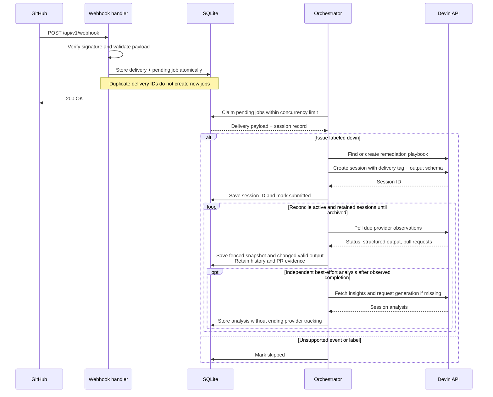

# Devin Remediator

Devin Remediator turns GitHub issues labeled `devin` into Devin sessions that
investigate and fix bugs. It tracks each session and stores its remediation
outputs, linked pull request, and session analysis.

## Quickstart

Export these environment variables in your shell, or put them in a `.env` file
in the repository root:

```dotenv
# Devin API key with access to sessions, playbooks, and insights.
DEVIN_API_KEY=<your-api-key>
# Devin organization where remediation sessions run.
DEVIN_ORGANIZATION_ID=<your-organization-id>
# Shared secret for verifying GitHub webhooks; use the same value in GitHub.
GITHUB_WEBHOOK_SECRET=<your-webhook-secret>
# Database path inside the container; keep it under /data for persistence.
SQLITE_DB_FILEPATH=/data/db.sql
```

Docker Compose loads `.env` automatically and passes these values to the app.
Exported shell variables take precedence. `.env` is ignored by Git.

Start the app:

```sh
docker compose up
```

The server listens on `http://localhost:8000`. Migrations run automatically, and
SQLite data persists in a Docker volume.

For local webhook forwarding through [Smee](https://smee.io), run:

```sh
MISE_ENV=local mise run webhook-forwarder
```

Use the channel URL printed by Smee, or pass `--url <channel-url>` to reuse one.
In your GitHub repository's webhook settings, use that URL, select
`application/json` and **Issues** events, and set the same webhook secret as
above. For a public deployment, use `https://<your-host>/api/v1/webhook`
instead. Add the `devin` label to an issue to trigger remediation.

## Enable issue attention comments with a GitHub App

1. Create a GitHub App with repository **Issues** permission set to **Read and
   write**.
2. Configure its webhook URL as `https://<your-host>/api/v1/webhook` and its
   webhook secret as `GITHUB_WEBHOOK_SECRET`.
3. Subscribe the App to **Issues** events and install it on the selected
   repositories. Use this webhook instead of a duplicate repository webhook.
4. Set all three application environment variables below. Preserve the private
   key's PEM newlines.

```dotenv
GITHUB_APP_ID=<positive-app-id>
GITHUB_APP_INSTALLATION_ID=<positive-installation-id>
GITHUB_APP_PRIVATE_KEY=<complete-RSA-private-key-PEM>
```

Only one installation is supported per deployment. No OAuth client secret or
personal access token is used. The inbound webhook secret is separate from the
App private key. Container deployments must explicitly forward these three
variables through their deployment configuration. The checked-in Compose file
does not forward them automatically.

With all three values absent or empty, remediation continues and startup logs
`attention.delivery_disabled`. Pending attention work remains in SQLite. Partial
credentials, invalid IDs, and invalid RSA keys fail configuration. A forward
migration adds notifications for sessions already waiting during upgrade.

When Devin enters `needs_input` or `needs_approval`, the App posts a generic
reason and a validated session link on the originating issue. Input comments ask
you to respond in Devin. Approval comments ask you to approve or decline there.
The authenticated Devin UI is the only continuation surface. GitHub replies are
not forwarded, and the service never sends messages or grants approval.

Comments do not contain progress, questions, blocker text, or verification
details. Those remain in SQLite and Devin. Links must exactly match
`https://app.devin.ai/sessions/<remote-session-id>` with a safe ID and no query,
fragment, or credentials. Invalid targets and links are blocked rather than
published.

### Delivery guarantees and limits

- Attention episodes are saved in the same transaction as accepted provider
  observations. Unchanged lifecycle, including changed progress text, does not
  create another episode. A different wait kind or an observed leave-and-reenter
  transition does.
- Each serialized orchestrator tick makes at most one GitHub HTTP request before
  Devin work. Token acquisition and each recovery page consume that same budget.
  Shared SQLite leases enforce at least three seconds between requests. Requests
  time out after ten seconds, below their sixty-second leases.
- `GitHubClient` in `src/github.ts` supplies an authenticated Octokit and owns
  App authentication and token caching. `GitHubCommentNotifier` in
  `src/github-comment-notifier.ts` owns durable comment delivery. Octokit signs
  App JWTs and acquires installation tokens. Tokens stay in memory and are
  reused only while more than one minute remains before expiry. The next
  delivery acquires a fresh token when needed. JWTs, private keys, and
  installation tokens are never persisted or logged. No retry or throttling
  plugins are installed.
- Retries use persisted exponential backoff with jitter, capped at one hour.
  GitHub rate-limit headers can extend that delay. Logs report sanitized
  failures and aggregate pending and blocked counts at most every five minutes.
- A possibly sent comment retains its immutable body, marker, App ID, and
  installation ID across restart. Recovery scans one issue-comment page per
  tick. A matching marker must have matching `performed_via_github_app.id`
  attribution. Missing or foreign attribution blocks automatic retry when no
  verified match exists. Changing App or installation identity does not transfer
  ownership of old ambiguous work.
- Two complete negative scans, separated by at least sixty seconds, precede any
  ambiguous retry. Incomplete scans never prove absence. Superseded unsent work
  is cancelled. Possibly sent superseded work is reconciled but never reposted.

GitHub has no exactly-once comment key. Delayed visibility, edited or deleted
markers, and remote request races can still duplicate comments. Blocked
ownership, attribution, or access failures require operator investigation; no
public retry or continuation endpoint is exposed. App attribution availability
is tested with mock responses, not guaranteed by a live fixture. Polling cannot
detect transitions entirely between observations or a new same-kind question
without an observed lifecycle transition.

Run the local mock integration checks with
`mise x -- deno task test src/github-comment-notifier.test.ts src/attention-migration.test.ts`.
Tests use synthetic RSA keys, temporary SQLite, and injected HTTP. They do not
contact GitHub or Devin.

## Tech stack

- **TypeScript on Deno** runs the HTTP server and background orchestrator in one
  process.
- **Hono** handles HTTP routes. **Octokit** verifies GitHub webhook signatures
  and sends App-authenticated attention comments.
- **Effect** manages services, concurrency, retries, and resource lifetimes.
- **Drizzle + SQLite** persist webhook deliveries, the work queue, and session
  results. No separate queue service is needed.
- **Devin's v3 API** provides playbooks, remediation sessions, and session
  insights.

## Data flow



The durable queue survives restarts. Transient submission failures retry within
an attempt limit; uncertain submissions are checked by delivery tag before
retrying. Local submission status is separate from provider lifecycle and
whether the bug was fixed. The structured remediation output captures Devin's
work: `fix_proposed` means a new fix was implemented, verified, and submitted as
a PR, not that it was merged. Routine review and merge belong in `next_action`,
not `blocker`. `needs_human` means implementation or verification needs human
input or a decision, or a security issue needs escalation.

`devin_sessions.outputs` is an ordered JSON array, defaulting to `[]`. Each
recorded result is appended without replacing earlier results. Existing database
objects migrate to one-element arrays, and null values migrate to empty arrays.
The array is independent of the local session status, so an active session can
retain earlier outputs. SQLite checks the array container; the existing
remediation schema validates each result received from Devin.

Devin's external `structured_output` remains a single object. Valid results are
recorded independently of lifecycle, including active, waiting, and paused work.
Unchanged content, reordered object keys, and null or invalid results do not
append. A later return to an earlier result does append. Polling can miss
changes between observations.

Waiting, paused, completed, and intervention states remain tracked on a durable
slower schedule. Resume a session in Devin's UI; the next observation updates
the same local identity without losing results. The service does not wake
sessions, approve actions, change budgets, or create replacements for missing
sessions. Archived sessions are closed locally. The 30-day continuation window
is a local advisory, never an age-based shutdown of active work.

`DEVIN_RETAINED_POLL_INTERVAL_MS` defaults to `60000`.
`DEVIN_ORCHESTRATOR_INTERVAL_MS` remains `3000` by default.
`DEVIN_ANALYSIS_MAX_ATTEMPTS` defaults to `12` and is forwarded by the
entrypoint. Set these in the application environment; custom Compose deployments
must also forward overrides. See
[passive session tracking](docs/passive-devin-lifecycle.md) for state policies,
capacity, fencing, migration, and operational limits.

## Observability

The app emits structured JSON logs for webhook receipt, session creation,
provider transitions, retries, and analysis collection. Correlate events with
`github_delivery_id`, `session_record_id`, and `devin_session_id` as they become
available.

```sh
docker compose logs -f app
```

The default log level is `Info`. Set `LOG_LEVEL=Debug` in the app's environment
for operation timings, queue capacity, and state transitions. With Docker
Compose, add `LOG_LEVEL: Debug` to `app.environment` in `compose.yaml`.

`session.provider_transition` records lifecycle and archive changes without raw
provider status, detail, or URLs. Unchanged polls and output-only changes do not
emit this event. Logs do not contain structured-output question text.
