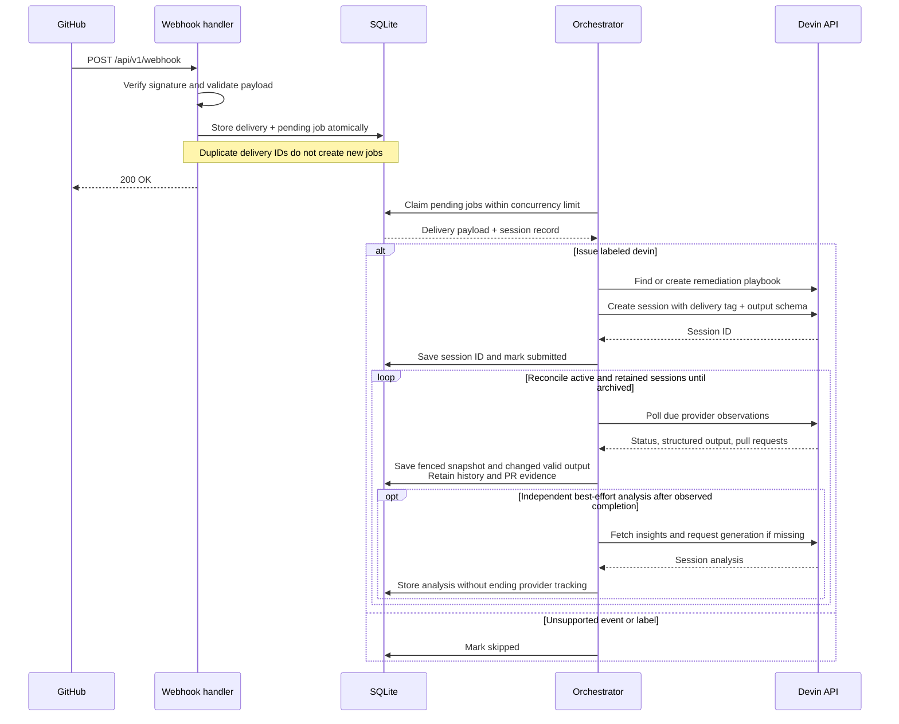

# Devin Remediator

Devin Remediator turns GitHub issues labeled `devin` into Devin sessions that
investigate and fix bugs. It tracks each session and stores its remediation
outputs, linked pull request, and session analysis.

## Quickstart

Export these environment variables in your shell, or put them in a `.env` file
in the repository root:

```dotenv
# Devin API key with access to sessions, playbooks, and insights.
DEVIN_API_KEY=<your-api-key>
# Devin organization where remediation sessions run.
DEVIN_ORGANIZATION_ID=<your-organization-id>
# Shared secret for verifying GitHub webhooks; use the same value in GitHub.
GITHUB_WEBHOOK_SECRET=<your-webhook-secret>
# Database path inside the container; keep it under /data for persistence.
SQLITE_DB_FILEPATH=/data/db.sql
```

Docker Compose loads `.env` automatically and passes these values to the app.
Exported shell variables take precedence. `.env` is ignored by Git.

Start the app:

```sh
docker compose up
```

The server listens on `http://localhost:8000`. Migrations run automatically, and
SQLite data persists in a Docker volume.

For local webhook forwarding through [Smee](https://smee.io), run:

```sh
MISE_ENV=local mise run webhook-forwarder
```

Use the channel URL printed by Smee, or pass `--url <channel-url>` to reuse one.
In your GitHub repository's webhook settings, use that URL, select
`application/json` and **Issues** events, and set the same webhook secret as
above. For a public deployment, use `https://<your-host>/api/v1/webhook`
instead. Add the `devin` label to an issue to trigger remediation.

## Tech stack

- **TypeScript on Deno** runs the HTTP server and background orchestrator in one
  process.
- **Hono** handles HTTP routes; **Octokit** verifies GitHub webhook signatures.
- **Effect** manages services, concurrency, retries, and resource lifetimes.
- **Drizzle + SQLite** persist webhook deliveries, the work queue, and session
  results. No separate queue service is needed.
- **Devin's v3 API** provides playbooks, remediation sessions, and session
  insights.

## Data flow



The durable queue survives restarts. Transient submission failures retry within
an attempt limit; uncertain submissions are checked by delivery tag before
retrying. Local submission status is separate from provider lifecycle and
whether the bug was fixed. The structured remediation output captures Devin's
work: `fix_proposed` means a new fix was implemented, verified, and submitted as
a PR, not that it was merged. Routine review and merge belong in `next_action`,
not `blocker`. `needs_human` means implementation or verification needs human
input or a decision, or a security issue needs escalation.

`devin_sessions.outputs` is an ordered JSON array, defaulting to `[]`. Each
recorded result is appended without replacing earlier results. Existing database
objects migrate to one-element arrays, and null values migrate to empty arrays.
The array is independent of the local session status, so an active session can
retain earlier outputs. SQLite checks the array container; the existing
remediation schema validates each result received from Devin.

Devin's external `structured_output` remains a single object. Valid results are
recorded independently of lifecycle, including active, waiting, and paused work.
Unchanged content, reordered object keys, and null or invalid results do not
append. A later return to an earlier result does append. Polling can miss
changes between observations.

Waiting, paused, completed, and intervention states remain tracked on a durable
slower schedule. Resume a session in Devin's UI; the next observation updates
the same local identity without losing results. The service does not wake
sessions, approve actions, change budgets, or create replacements for missing
sessions. Archived sessions are closed locally. The 30-day continuation window
is a local advisory, never an age-based shutdown of active work.

`DEVIN_RETAINED_POLL_INTERVAL_MS` defaults to `60000`.
`DEVIN_ORCHESTRATOR_INTERVAL_MS` remains `3000` by default.
`DEVIN_ANALYSIS_MAX_ATTEMPTS` defaults to `12` and is forwarded by the
entrypoint. Set these in the application environment; custom Compose deployments
must also forward overrides. See
[passive session tracking](docs/passive-devin-lifecycle.md) for state policies,
capacity, fencing, migration, and operational limits.

## Observability

The app emits structured JSON logs for webhook receipt, session creation,
provider transitions, retries, and analysis collection. Correlate events with
`github_delivery_id`, `session_record_id`, and `devin_session_id` as they become
available.

```sh
docker compose logs -f app
```

The default log level is `Info`. Set `LOG_LEVEL=Debug` in the app's environment
for operation timings, queue capacity, and state transitions. With Docker
Compose, add `LOG_LEVEL: Debug` to `app.environment` in `compose.yaml`.

`session.provider_transition` records lifecycle, raw state/detail, and archive
changes. Unchanged polls and output-only changes do not emit this event. Logs do
not contain structured-output question text.
